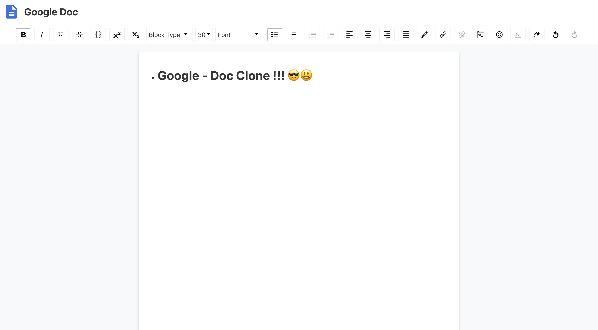

# Google Clone (practice) 
> learn by doing : React, CSR, draft, Express, MongoDB
---


---
## Stack 
- [React](https://reactjs.org/) : A JavaScript library for building user interfaces 
- [Styled Components](https://styled-components.com/docs) : Utilising tagged template literals (a recent addition to JavaScript) and the power of CSS, styled-components allows you to write actual CSS code to style your components. It also removes the mapping between components and styles – using components as a low-level styling construct could not be easier!
- [MongoDB](https://www.mongodb.com/) : MongoDB is a document database with the scalability and flexibility
- [Express](https://expressjs.com/) : Express is a minimal and flexible Node.js web application framework

---
## Project structure 
```
.
├── README.md
├── backend
│   └── src
│       ├── controller     
│       ├── middlewares  
│       ├── models
│       ├── routes
│       └── server.js
└── frontend
     └── src
         ├── api 
         ├── components
         ├── context
         ├── hooks
         ├── pages
         ├── styles
         └── lib
```
